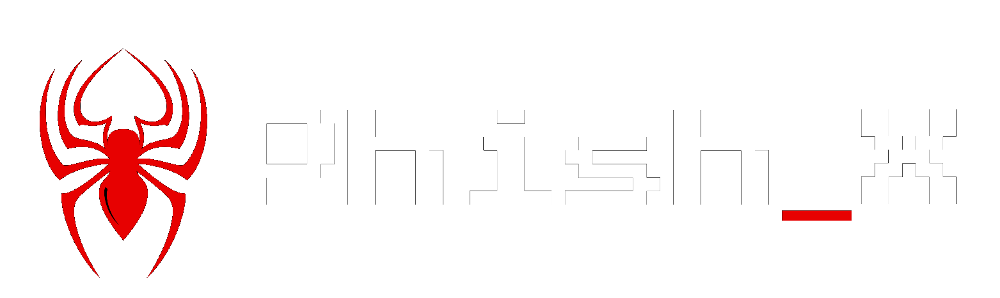
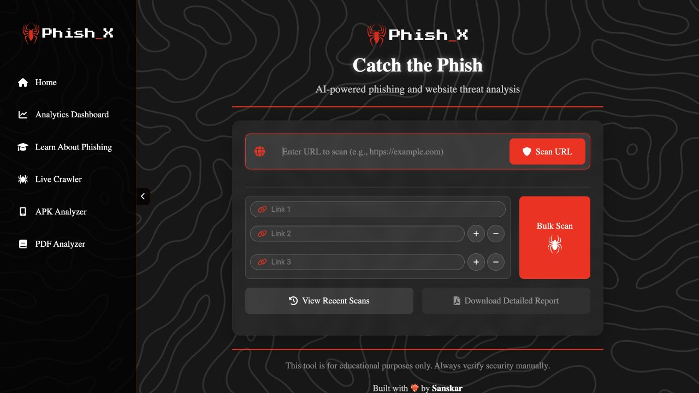

<p align="center">
  
</p>

<p align="center">
  <a href="https://phishxai.vercel.app/"><strong>Open Phish-X AI ↗</strong></a> &nbsp;·&nbsp;
  <a href="#run-it-yourself">Run locally</a> &nbsp;·&nbsp;
  <a href="docs/OPERATIONS.md">Engineering guide</a> &nbsp;·&nbsp;
  <a href="AUDIT.md">Security audit</a>
</p>


<p align="center">
  <a href="https://github.com/Madxfury/Phish-X/actions/workflows/diagnostics.yml"></a>
  
  
  
  
</p>

> **A URL is the starting point. The evidence is the story.**
>
> Phish-X AI combines live website inspection, security signals, threat intelligence and AI evidence reasoning to explain why a page appears safe or suspicious. Every finding connects to a collected observation; unavailable services stay visibly unavailable.

### One scan. An inspectable trail.

```text
                      CATCH THE PHISH
                             │
        URL → public DNS → bounded HTTPS fetch
                             │
              redirects · HTML · forms · scripts
                             │
             evidence ledger + threat intelligence
                             │
               explainable score → AI interpretation
                             │
                saved evidence → same-scan PDF
```

<table>
  <tr>
    <td width="50%"><strong>01 / Inspect the website</strong><br>Actual HTTP, DNS and TLS observations. Parsed HTML, form destinations, password/payment fields, resources and bounded static JavaScript inspection.</td>
    <td width="50%"><strong>02 / Explain the assessment</strong><br>Transparent evidence contributions plus genuine server-side Groq reasoning. Supporting citations, coverage limits and recommended actions appear with the result.</td>
  </tr>
  <tr>
    <td><strong>03 / Explore the connections</strong><br>Phishing DNA, attack-surface snapshot, an entity relationship explorer and a measured scan timeline. Each entity comes from collected evidence.</td>
    <td><strong>04 / Keep the workflow</strong><br>Bulk links, private recent history, analytics, the original crawler page, PDF reports, APK/PDF static analyzers and phishing education.</td>
  </tr>
</table>

### The interface

The original Phish-X dark identity, sidebar, logo, terminal intro and decrypting heading remain. Home reload starts the landing experience again. Navigation between pages retains the current session, and stored history remains available.



*An actual application capture. Bulk inputs accept up to ten links; Vercel processes consecutive two-URL batches with progress and explicit errors.*

### How to read a result

| View | What it means |
| :--- | :--- |
| **Risk score · 0–100** | Explainable heuristic evidence points. The score is not a probability of phishing. |
| **SAFE → CRITICAL** | Severity of observed evidence. Missing observations do not establish safety. |
| **AI reasoning** | A real model interpretation with citations. AI confidence is self-reported and uncalibrated; interpretations can be wrong. |
| **Phishing DNA** | Evidence contributions by dimension, not invented percentages. |
| **Attack surface / relationships** | Forms, resources, domains and connections actually discovered in the scan. |
| **Coverage / timeline** | Which stages completed, failed, timed out or were unavailable. |

The deterministic score remains available if AI fails. Model output cannot overwrite that score or downgrade a warning. Warning citations are restricted to actual scoring evidence; unsupported outputs are discarded, with one bounded genuine Groq regeneration where possible.

### Run it yourself

Use **Python 3.12**, then run from the project directory:

```bash
python3 -m venv .venv
source .venv/bin/activate
python -m pip install -r requirements.txt
cp .env.example .env    # only if you do not already have .env
python app.py
```

The default local address is **http://127.0.0.1:5001**. Change `FLASK_PORT` in `.env` if needed. Add provider credentials to `.env` for actual AI and threat intelligence; it is ignored by Git and excluded from deployment.

```dotenv
AI_PROVIDER=groq
GROQ_MODEL=openai/gpt-oss-120b
GROQ_API_KEY=your_server_side_key
VIRUSTOTAL_API_KEY=your_server_side_key
```

Local development uses SQLite when no cloud database is configured. Production uses a pooled **Neon Postgres `DATABASE_URL`** and a stable **`SECRET_KEY`**. MongoDB remains a supported alternative. OpenAI and Ollama are optional AI providers; no simulated AI fallback exists.

### Deploy on Vercel

1. Import this repository with Flask detection and the existing `vercel.json`.
2. Connect a free Neon database and configure its pooled `DATABASE_URL`.
3. Add `SECRET_KEY`, `AI_PROVIDER`, `GROQ_API_KEY`, `GROQ_MODEL` and `VIRUSTOTAL_API_KEY` as server environment variables.
4. Deploy, check `/api/readiness`, then run a fresh scan and verify actual AI, stored evidence and its PDF.

[Complete environment reference and deployment guide →](docs/OPERATIONS.md)

Vercel runs bounded HTTP scans. Each bulk request accepts at most two URLs; the browser submits up to ten URLs across sequential batches. Linked-page crawling is available locally; Vercel analyzes one submitted page per crawler request. Uploads are capped at 4 MiB on Vercel and analyzed in isolated, time-limited workers. SocketIO is local-only; the hosted interface works through HTTP.

### Boundaries that matter

- **Crawler:** public HTTP/HTTPS only, validated DNS and redirects, pinned public-IP connections, verified TLS, timeouts and size limits. No remote JavaScript execution or form submission.
- **Intelligence:** VirusTotal vendor opinions and optional Safe Browsing results are displayed as received. Free-service quotas and network failures are explicit.
- **AI:** third-party page text is untrusted evidence. Validated citations reduce unsupported claims; they do not prove every model interpretation true.
- **Privacy:** history and reports are browser-session scoped. Submitted URLs/evidence go to the configured services; avoid private tokens or confidential URLs. Uploaded APK/PDF files are analyzed temporarily, not sent to those services.
- **File analysis:** bounded static inspection, not exhaustive antivirus analysis or AI malware detection.

### For contributors

```bash
python -m pip install -r requirements-dev.txt
python -m pytest tests -q
node --test tests/test_*.js
python prepare_vercel.py --check
```

`static/` is the source for the existing frontend. After changing an asset, run `python prepare_vercel.py` and commit matching `public/static/` copies so Vercel serves the same UI from its CDN.

| Read next | Contents |
| :--- | :--- |
| [Engineering & operations](docs/OPERATIONS.md) | Full scanner behavior, services, storage, limits and deployment details |
| [Audit](AUDIT.md) | Original implementation issues and corrections |
| [Validation](VALIDATION.md) | Recorded tests and live verification, with practical limitations |
| [Diagnostics workflow](https://github.com/Madxfury/Phish-X/actions/workflows/diagnostics.yml) | Python regressions, JavaScript checks and asset consistency |

---

<p align="center">
  Built with ❤️‍🔥 by <strong>Sanskar</strong><br>
  <a href="https://www.sanskarparab.me/">Portfolio</a> &nbsp;·&nbsp;
  <a href="https://www.linkedin.com/in/sanskarparab/">LinkedIn</a> &nbsp;·&nbsp;
  <a href="https://github.com/Madxfury">GitHub</a> &nbsp;·&nbsp;
  <a href="mailto:sanskar.work12@gmail.com">Email</a>
</p>
